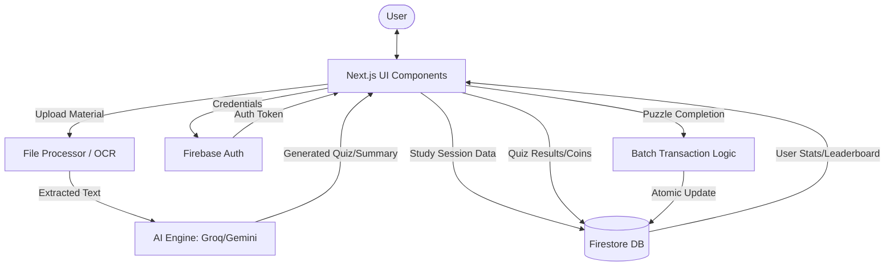
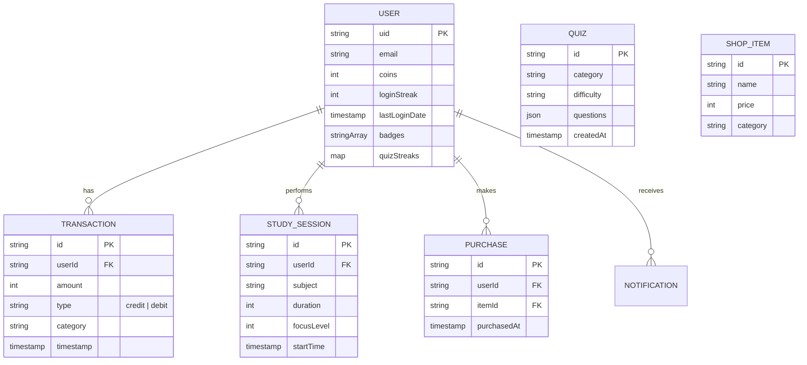

# 🎓 StudiFy: The AI-Driven Gamified Learning Ecosystem
### Comprehensive Technical & Functional Documentation

StudiFy is a state-of-the-art educational platform that integrates Generative AI with Behavioral Gamification to transform the learning experience. This document provides an exhaustive breakdown of every major and minor detail of the project, from high-level architecture to granular implementation logic.

---

## 1. Project Vision & Behavioral Model
StudiFy is built on the "Octalysis" gamification framework, targeting core drives like:
- Development & Accomplishment: Through levels, coins, and badges.
- Empowerment of Creativity: Through personalized AI study paths.
- Social Influence: Through competitive leaderboards.
- Loss & Avoidance: Through streak maintenance requirements.

---

## 2. Core Features: Implementation Deep-Dive

### 🧠 AI Study Intelligence (The "Brain" Module)
- Multi-Provider AI Engine:
  - Groq Integration: Used for ultra-fast cloud inference (Llama 3/Mixtral) when the `GROQ_API_KEY` is present.
  - Ollama Integration: Fallback for local, private AI processing on port `11434`.
  - Google Gemini Pro: Powering structured quiz generation and deep study insights via 
  [ollamaService.ts](file:///c:/Users/ojasv/Desktop/StudiFy/src/lib/ollamaService.ts).
- File Processing & OCR:
  - Extracts text from PDFs, TXT, and Images (using OCR).
  - Built with a specialized [fileProcessor.ts](file:///c:/Users/ojasv/Desktop/StudiFy/src/lib/fileProcessor.ts) that handles base64 image data for multimodal AI analysis.
- Smart Quiz Generator: 
  - Generates custom 5-question quizzes from any uploaded document.
  - Features a Hint System that provides contextual clues without revealing answers, accessed via `/api/ai/hint`.

### 🎮 Gamification & Economy (The "Loop")
- Daily Bonus & Gated Rewards:
  - Users cannot claim rewards by just logging in. They must solve a Daily Puzzle in [DailyPuzzleModal.tsx](file:///c:/Users/ojasv/Desktop/StudiFy/src/components/DailyPuzzleModal.tsx).
  - Rotation Logic: The game changes daily based on `new Date().getDay() % 3`:
    - Memory Game: Icon matching (Mental agility).
    - Math Challenge: Arithmetic equations (Logical speed).
    - Word Scramble: Vocabulary unscrambling (Linguistic skills).
- Streak & Reward Math:
  - Base Reward: 100 Coins.
  - Streak Bonus: `100 + (streak * 5)` Coins.
  - Streak Logic: Resets if the user misses a day (calculated by comparing `lastLoginDate` with the current date).
- StudiFy Market: 
  - Users purchase Badges, Profile Themes, and Boosters.
  - Inventory System: Tracks owned items and active customizations in the `userInventory` Firestore sub-collection.

### 📊 Productivity & Analytics (The "Story")
- Growth Velocity: Uses `Recharts` to visualize coin earnings over a 30-day window.
- Engagement Spectrum: A bar chart breakdown of activity types (Quizzes, Bonuses, etc.).
- Revenue Ecosystem: A pie chart showing where the user's wealth comes from (Math vs. Programming vs. General).

---

## 3. Technical Architecture & Tech Stack

### Frontend (The "Skin")
- Framework: [Next.js 15](file:///c:/Users/ojasv/Desktop/StudiFy/package.json) with App Router.
- Styling: Tailwind CSS with a custom "Glassmorphism" design system.
- Animations: Framer Motion for micro-interactions and page transitions.
- Components: Radix UI primitives (Dialogs, Tabs, Selects, etc.) styled with `class-variance-authority`.

### Backend (The "Skeleton")
- Platform: Firebase (BaaS).
- Database: Firestore (NoSQL) with real-time listeners.
- Authentication: Firebase Auth (Email/Password & Google).
- State Management: React Context API (`AuthContext`, `ThemeContext`).

### AI & Data Science (The "Mind")
- LLM Orchestration: [Firebase GenKit](file:///c:/Users/ojasv/Desktop/StudiFy/src/ai/dev.ts).
- Streaming: Server-Sent Events (SSE) for real-time AI typing effects in the chatbot.

---

## 4. System Diagrams

### 🗺️ Data Flow Diagram (DFD - Level 1)
The following diagram illustrates how data moves between the user, the application interface, the AI engine, and the Firebase backend.



### 🗄️ Entity Relationship Diagram (ERD)
This diagram represents the NoSQL document relationships and data structures within Firestore.



## 5. Database Schema (Firestore)

### `users` Collection
| Field | Type | Description |
| :--- | :--- | :--- |
| `uid` | string | Unique User ID |
| `coins` | number | Current currency balance |
| `loginStreak` | number | Consecutive days active |
| `lastLoginDate`| Timestamp | Last activity date |
| `badges` | array | List of earned badge IDs |
| `rank` | number | Global leaderboard position |

### `transactions` Collection
- Tracks every coin change with `amount`, `type` (credit/debit), and `category`.

### `quizzes` Collection
- Stores both global daily quizzes and user-generated custom quizzes with `questions`, `difficulty`, and `subject`.

---

## 5. API Reference

- `/api/ai/status`: Checks if Groq or Ollama is available.
- `/api/daily-quiz`: Fetches or generates the unique quiz for the current day.
- `/api/generate-quiz`: Takes text input and returns a structured AI quiz.
- `/api/ollama`: Proxies requests to the AI engine for the Study Assistant.
- `/api/extract-text`: Handles file-to-text conversion for the AI.

---

## 6. Development & Deployment
- Initialization: Data is seeded via [initializeData.ts](file:///c:/Users/ojasv/Desktop/StudiFy/src/scripts/initializeData.ts).
- Deployment: [deploy.ps1](file:///c:/Users/ojasv/Desktop/StudiFy/deploy.ps1) automates Next.js builds and Firebase hosting deployment.
- Environment: Requires `.env.local` with `NEXT_PUBLIC_FIREBASE_CONFIG` and `GROQ_API_KEY`.

---

## 7. Application Flow Logic
1.  Auth: User logs in → AuthContext initializes → Profile data fetched.
2.  Daily: User completes Daily Puzzle → Firestore Batch Transaction updates coins/streak/activity log.
3.  Study: User starts session → Timer tracks duration → User logs focus/productivity → Analytics updated.
4.  AI: User uploads PDF → `fileProcessor` extracts text → AI provides summary/quiz → Knowledge base expanded.

## 8. Troubleshooting & Common Issues

### 🔐 Google Auth: "Error 401: deleted_client" or "Error 400: redirect_uri_mismatch"
**Issue**: This occurs when the OAuth 2.0 Client ID is misconfigured or deleted.

**Fix**:
1.  Navigate to the [Firebase Console](https://console.firebase.google.com/) for project **studify-2**.
2.  Go to **Project Settings** -> **General**.
3.  Scroll down to **Your apps** -> **SDK setup and configuration** and copy the new config to `.env.local`.
4.  Go to **Authentication** -> **Sign-in method** -> **Google**.
5.  Expand **Web SDK configuration** and ensure the **Client ID** and **Client secret** match the ones in your Google Cloud Console.
6.  Go to the [Google Cloud Console Credentials page](https://console.cloud.google.com/apis/credentials).
7.  Verify the **Authorised JavaScript origins** and **Authorised redirect URIs**:
    - **JavaScript Origin**: `https://studify-2.firebaseapp.com`
    - **Redirect URI**: `https://studify-2.firebaseapp.com/__/auth/handler`

### 🛡️ Firestore: "Missing or insufficient permissions"
**Issue**: You encounter `FirebaseError: [code=permission-denied]` in the console when trying to read/write data. This happens because the new Firestore database defaults to "Locked Mode".

**Fix**:
1.  Go to the [Firebase Console](https://console.firebase.google.com/) -> **Firestore Database**.
2.  Click on the **Rules** tab.
3.  Replace the existing rules with the following (for development):
    ```javascript
    rules_version = '2';
    service cloud.firestore {
      match /databases/{database}/documents {
        match /{document=**} {
          allow read, write: if request.auth != null;
        }
      }
    }
    ```
4.  Click **Publish**.
5.  **Note**: This rule allows any authenticated user to read/write all data. For production, you should refine these to specific collections.

### 🚫 Browser: `net::ERR_BLOCKED_BY_CLIENT` (Brave/Ad-Blockers)
**Issue**: This error appears in the console, and the app fails to load or connect to Firebase. It is caused by **Brave Shields** or extensions like **uBlock Origin** incorrectly flagging Firebase's real-time connection (Firestore/Auth) as a tracker.

**Fix**:
1.  **Disable Brave Shields**:
    - Click the **Lion icon** next to the address bar.
    - Toggle the switch to **Shields are DOWN**.
2.  **Check Extensions**:
    - If you use ad-blockers (AdBlock, uBlock), whitelist `localhost`.
3.  **Disable "Trackers & ad blocking"**:
    - In Brave Settings -> Shields, set "Trackers & ad blocking" to **Disabled** for local development.

---
*This document is maintained as the source of truth for the StudiFy engineering team.*
